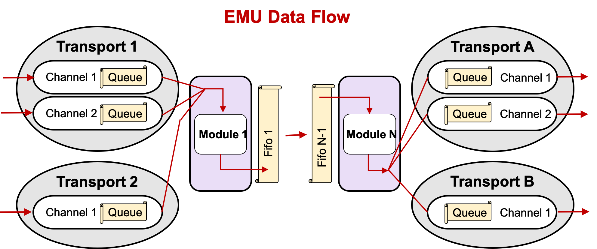

----------------------------

# **EMU 3.3 SOFTWARE PACKAGE**

----------------------------

The **EMU** or **E**vent **M**anagement **U**nit is used to as structure in which to
contain a CODA (CEBAF Online Data Acquisition) software component such as and event builder
or an event recorder. The EMU not only handles the module - which provides the main
functionality - but also all the communication channels into and out of the module.

It was written by Carl Timmer of the Data Acquisition group of the
Thomas Jefferson National Accelerator Facility.

This software runs on Linux and Mac OSX.

You must install Java version 8 or higher if you plan to compile
the ET java code and run it. If you're using the jar file from the CODA
website, Java 8 or higher is necessary since it was compiled with that version.

----------------------------

### **EMU System event flow**

----------------------------

### **Main EMU links:**

  [EMU Home Page](https://coda.jlab.org/drupal/content/event-management-unit-emu-0/)

  [EMU on GitHub](https://github.com/JeffersonLab/emu)

  
-----------------------------

# **Documentation**

----------------------------

Documentation on GitHub:

* [All Documentation](https://jeffersonlab.github.io/emu)

Documentation on the home page:

* [User's Guide PDF](https://coda.jlab.org/drupal/content/emu-33-users-guide)
* [Javadoc for Java Library](https://coda.jlab.org/drupal/content/emu-33-javadoc)

----------------------------

# **Java**

----------------------------

One can download the Java 8, pre-built emu-3.3.jar file from either:

  [Jar File @ Home Page](https://coda.jlab.org/drupal/content/emu-33)
 
or

  [Jar File @ GitHub](https://github.com/JeffersonLab/emu/blob/emu-3.3/java/jars/java8/emu-3.3.jar)

One can find the pre-built emu-3.3.jar file in the repository in the java/jars/java8
directory built with Java 8, or in the java/jars/java15 directory built with Java 15,
or it can be generated. The generated jar file is placed in build/lib.
In any case, put the jar file into your classpath and run your java application.

If you're using the pre-built jar file, Java version 8 or higher is necessary since
it was compiled with that version. Also, when generating it, it’s advisable to use
Java version 8 or higher since all other pre-built CODA jar files have been compiled with Java 8.
If you wish to recompile the java part of ET, ant must be installed
on your system (http://ant.apache.org):
  
    cd <et dir>
    ant

To get a list of options with ant, type _**ant help**_:

    help: 
        [echo] Usage: ant [ant options] <target1> [target2 | target3 | ...]
    
        [echo]      targets:
        [echo]      help        - print out usage
        [echo]      env         - print out build file variables' values
        [echo]      compile     - compile java files
        [echo]      clean       - remove class files
        [echo]      cleanall    - remove all generated files
        [echo]      jar         - compile and create jar file
        [echo]      install     - create jar file and install into 'prefix'
        [echo]                    if given on command line by -Dprefix=dir',
        [echo]                    else install into CODA if defined
        [echo]      uninstall   - remove jar file previously installed into 'prefix'
        [echo]                    if given on command line by -Dprefix=dir',
        [echo]                    else installed into CODA if defined
        [echo]      all         - clean, compile and create jar file
        [echo]      javadoc     - create javadoc documentation
        [echo]      developdoc  - create javadoc documentation for developer
        [echo]      undoc       - remove all javadoc documentation
        [echo]      prepare     - create necessary directories

To generate a new EMU jar file, type "ant jar" which will
create the file and place it in build/lib.

Included in the java/jars subdirectory are all auxiliary jar files used
by the GUI graphics. These are installed when executing "ant install"
and uninstalled when executing "ant uninstall".

----------------------------

# **Generating Documentation**

----------------------------

All documentation links are provided above.

However, if using the downloaded distribution, some of the documentation
needs to be generated and some already exists. For existing docs look in
doc/usersGuide for pdf and Microsoft Word format documents.

Some of the documentation is in the source code itself and must be generated
and placed into its own directory.
The java code is documented with, of course, javadoc.

To generate all the these docs, from the top level directory type:

    ant javadoc
    
for user-level documentation, or

    ant developdoc
    
for developer-level documentation. To remove it:

    ant undoc

----------------------------

# **Copyright**

----------------------------

For any issues regarding use and copyright, read the [license](LICENSE.txt) file.

