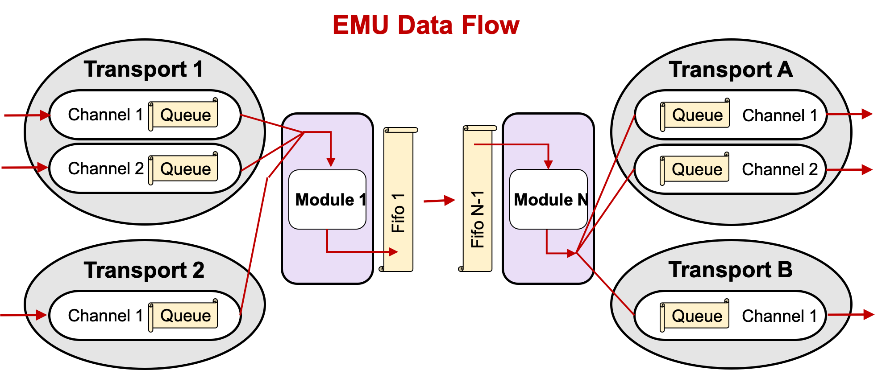

----------------------------

# **EMU 3.3 SOFTWARE PACKAGE**

----------------------------

The **EMU** or **E**vent **M**anagement **U**nit is used to as structure in which to
contain a CODA (CEBAF Online Data Acquisition) software component such as and event builder
or an event recorder. The EMU not only handles the module - which provides the main
functionality - but also all the communication channels into and out of the module.

EMU is currently maintained by Jon Zarling in the EPSCI group (jzarling@jlab.org). It was 
written by Carl Timmer of the Data Acquisition group of the Thomas Jefferson National 
Accelerator Facility.

This software runs on Linux and Mac OSX.

You must install Java version 8 or higher if you plan to compile
the EMU java code and run it. If you're using the jar file from the CODA
website, Java 8 or higher is necessary since it was compiled with that version.

----------------------------

### **EMU System event flow**

----------------------------

### **Main EMU links:**

  [EMU Home Page](https://coda.jlab.org/drupal/content/event-management-unit-emu-0/)

  [EMU on GitHub](https://github.com/JeffersonLab/emu)

  
-----------------------------

# **Documentation**

----------------------------

Documentation on GitHub:

* [All Documentation](https://jeffersonlab.github.io/emu)

----------------------------

# **Java**

----------------------------

One can download the Java 8, pre-built emu-3.3.jar file from:
 
  [Jar File @ GitHub](https://github.com/JeffersonLab/emu/blob/emu-3.3/java/jars/java8/emu-3.3.jar)

One can find the pre-built emu-3.3.jar file in the repository in the java/jars/java8
directory built with Java 8, or in the java/jars/java15 directory built with Java 15,
or it can be generated. The generated jar file is placed in build/lib.
In any case, put the jar file into your classpath and run your java application.

If you're using the pre-built jar file, Java version 8 or higher is necessary since
it was compiled with that version. Also, when generating it, it’s advisable to use
Java version 8 or higher since all other pre-built CODA jar files have been compiled with Java 8.

To build a new jar file do:

	./gradlew
The newly created jar file will be places in `build/lib/`. To change java version

In addition to standard gradle options, the following commands can be run:

- `./gradlew env` prints variables and paths used for building and installation
- `./gradlew javadoc` create javadoc documentation 
- `./gradlew developdoc` create javadoc documentation for developers 
- `./gradlew undoc` remove all javadoc documentation 
- `./gradlew install -Pprefix=/your/install/path` create javadoc documentation for developers 
- `./gradlew uninstall` remove jar file previously installed into `prefix`, if given on command line by `-Dprefix=dir`. Else uninstall from `$CODA` if defined.

To see a full list of options, run `./gradlew tasks`. To change java versions, edit the line 

	toolchain { languageVersion.set(JavaLanguageVersion.of(8)) }
 with desired java version in the file `build.gradle.kts`.

----------------------------

# **Generating Documentation**

----------------------------

All documentation links are provided above.

However, if using the downloaded distribution, some of the documentation
needs to be generated and some already exists. For existing docs look in
doc/usersGuide for pdf and Microsoft Word format documents.

Some of the documentation is in the source code itself and must be generated
and placed into its own directory.
The java code is documented with, of course, javadoc.

----------------------------

# **Copyright**

----------------------------

For any issues regarding use and copyright, read the [license](LICENSE.txt) file.
